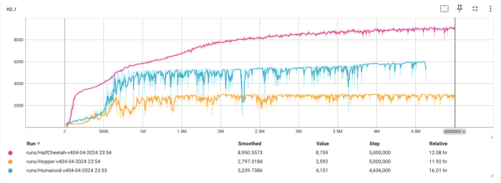

## Dependencies
```python
gymnasium==0.29.1
numpy==1.26.2
pytorch==2.1.1

python==3.10.13
```

## How to use my code
### Train from scratch
```bash
python main.py
```
where the default enviroment is 'Humanoid-v4'.  

### Play with trained model
```bash
python main.py --EnvIdex 1 --render True --Loadmodel True --ModelIdex 50
```
which will render the 'HalfCheetah-v4'.  

### Change Enviroment
If you want to train on different enviroments, just run 
```bash
python main.py --EnvIdex 1
```
The ```--EnvIdex``` can be set to be 0~5, where
```bash
'--EnvIdex 0' for 'Humanoid-v4'  
'--EnvIdex 3' for 'HalfCheetah-v4'  
'--EnvIdex 4' for 'Hopper-v4'  
'--EnvIdex 5' for 'HumanoidStandup-v4' 
```

### Visualize the training curve
You can use the [tensorboard](https://pytorch.org/docs/stable/tensorboard.html) to record anv visualize the training curve. 

- Record (the training curves will be saved at '**\runs**'):
```bash
python main.py --write True
```

- Visualization:
```bash
tensorboard --logdir runs
```


## Example benchmark


|      Environment       |      SAC      | TD3 | 
| :--------------------: | :----------------: | :-------------------: | 
|          Ant-v4           |  **3941.8±264.7**  |         **4125.8±79.7**        
|         Hopper-v4         |  **3512.2±16.5**   |         **3022.6±216.5**        |    

## Example benchmark


|      Environment       |      SAC      | GSAC | 
| :--------------------: | :----------------: | :-------------------: | 
|         Hopper-v4         |  **3512.2±16.5**   |         **3124.6±216.5**        |    
|          Ant-v4           |  **3941.8±264.7**  |         **4125.8±79.7**        |
|          Humanoid-v4           |  **3941.8±264.7**  |         **4125.8±79.7**        |
    